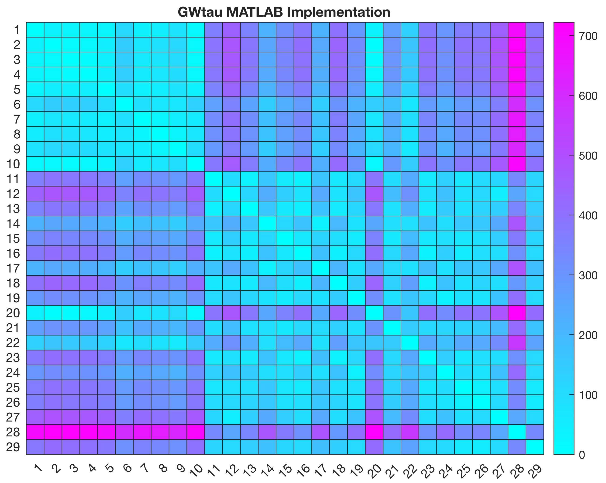
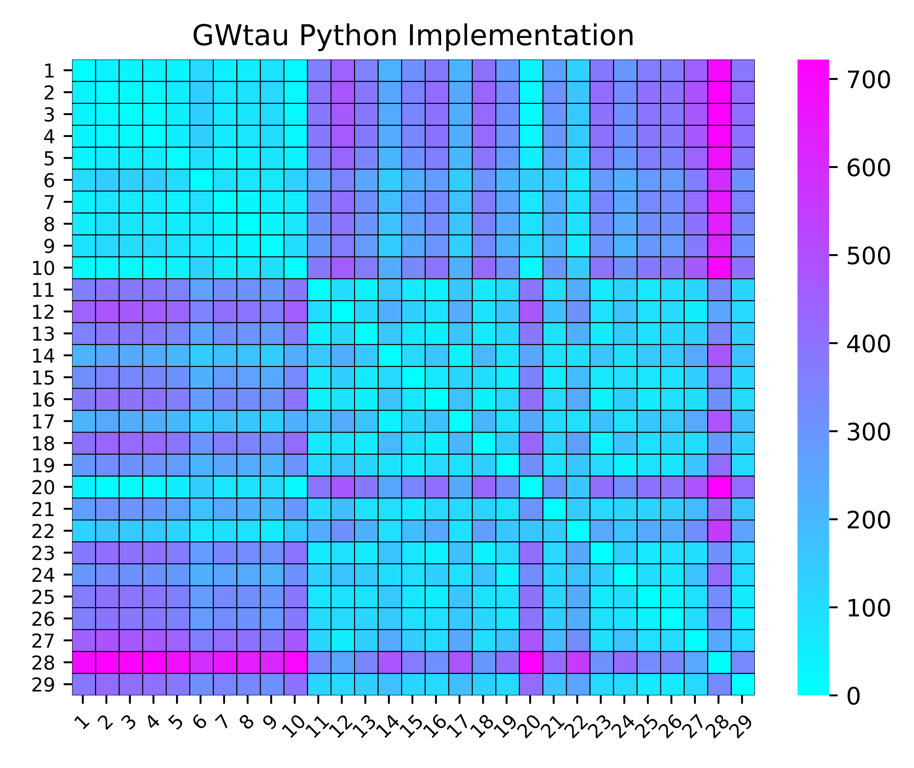
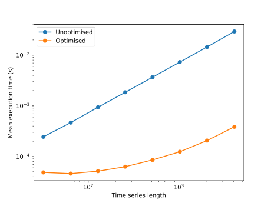

# Incorporating new SPIs

## Overview

_pyspi_ is designed with modularity in mind, making it easy for users to add new SPIs to the existing framework. In this tutorial, we'll walk you through the process of incorporating a new SPI called the Gromov-Wasserstein distance (**GWTau**), from scratch. This implementation is based on the recent paper by [Kravtsova et al](https://link.springer.com/article/10.1007/s11538-023-01175-y).

By following these guidelines, you'll be able to create new SPIs that seamlessly integrate with _pyspi_ and contribute to a robust library of SPIs for the community to use.

Let's get started with adding the GWTau SPI to _pyspi_!

## **Table of contents** :scroll:

1. [Writing the SPI function](incorporating-new-spis.md#id-1.-writing-the-spi-function) :man\_technologist:
2. [Validating the algorithm ](incorporating-new-spis.md#validation-benchmarking) :white\_check\_mark:
3. [Optimisation](incorporating-new-spis.md#id-3.-optimising-the-algorithm) :bullettrain\_side:
4. [Incorporating the SPI into the _pyspi_ framework](incorporating-new-spis.md#id-4.-incorporating-your-spi-into-the-pyspi-framework) :earth\_asia:
5. [Updating the configuration YAML files ](incorporating-new-spis.md#id-5.-updating-the-configuration-files):recycle:
6. [\[OPTIONAL\] Creating a pull request](incorporating-new-spis.md#id-6.-optional-create-a-pull-request) :hand\_splayed:

***

## 1. Writing the SPI function :man\_technologist:

By definition, SPIs are pairwise measures - that is, they take in a pair of time series (as arrays) and compute a summary statistic which captures some aspect of the relationship between them (as a scalar value output). With this in mind, each SPI corresponds to a function with the following general form:

$$
f(\bold{x}, \bold{y}) = s,
$$

where $$\bold{x}$$ and $$\bold{y}$$ are the two time series (assumed to be the same length) for which the SPI is to be computed on, and $$s$$is a real, scalar-valued output. For a dataset of **p** processes (time series), _pyspi_ will apply your SPI function to pairs of time series, yielding a $$p \times p$$ matrix of pairwise interactions ([MPI](../../information-about-pyspi/spis/glossary-of-terms.md)).

### Developing your SPI function in isolation

Whether you choose to implement the SPI algorithm from scratch or adapt an existing function from another library, the end goal is to create a function that can be generically applied to pairs of time series. In either case, a good starting point is to develop or adapt the algorithm in **isolation** first. This approach allows you to focus on the core logic of the SPI without worrying about the broader framework. By working on the SPI independently, you can ensure that the function is correct, efficient, and well-tested before incorporating it into _pyspi_.

An excellent way to develop your SPI function in isolation is by using an interactive notebook, such as _Jupyter Notebook_ or _Google Colab_. Interactive notebooks provide several benefits for a first pass:

1. **Iterative Development**: Notebooks allow you to write and test code in small chunks, making it easier to iterate and refine your implementation.
2. **Visualisation**: You can easily visualise your results and intermediate steps, helping you gain insights into the behavior of your SPI.
3. **Debugging**: Interactive notebooks make it convenient to debug your code by examining variables and testing different scenarios.
4. **Documentation**: Notebooks support markdown cells, enabling you to document your code and thought process alongside the implementation.

In the example below, we port an [existing implementation](https://github.com/kravtsova2/GWtau) of **GWTau** from MATLAB to Pytho&#x6E;**.** In order to compute this SPI, our final pairwise function, $$f(x,y)$$, called `gwtau()` relies on two helper functions: `wass_sorted()` and `vec_geo_dist():`



First, we import all necessary libraries to compute our SPI. In this implementation, we only require _NumPy._

```python
import numpy as np
```

Next, we define our two helper functions based on the implementations in MATLAB.&#x20;

```python
# Compute a vector of distances of each point on the
# trajectory x from the start of the trajectory
def vec_geo_dist(x):
    d_old = 0
    v = np.zeros(len(x)-1)
    for i in range(0, len(x)-1):
        d_new = np.linalg.norm(x[i, :] - x[i+1, :])
        v[i] = d_old + d_new # accumulate
        d_old = v[i]
    return v
    
def wass_sorted(x1, x2):
    x1 = np.sort(x1)[::-1] # sort in descending order
    x2 = np.sort(x2)[::-1] 
    if len(x1) == len(x2):
        res = sum((x1-x2)**2)/len(x1) # 2-Wasserstein distance
        res = np.sqrt(res)
    else:
        N = len(x1)
        M = len(x2)

        lam = 0
        my_sum = 0

        for i in range(1, (N+1)):
            for j in range(1, (M+1)):
                if np.minimum(i*M, j*N) > np.maximum((i-1)*M, (j-1)*N):
                    lam = np.minimum(i/N, j/M) - np.maximum((i-1)/N, (j-1)/M)
                    my_sum += lam*(x1[i-1] - x2[j-1])**2
        res = np.sqrt(my_sum)

    return res
```

Now, we define the pairwise function which takes in any two time series **xi** and **xj**, and returns a scalar output, **sij.**

```python
def gwtau(xi, xj):
    timei = np.arange(len(xi))
    timej = np.arange(len(xj))
    traji = np.column_stack([timei, xi])
    trajj = np.column_stack([timej, xj])

    vi = vec_geo_dist(traji)
    vj = vec_geo_dist(trajj)
    gw = wass_sorted(vi, vj)
    
    return gw
```



## Additional Considerations :exclamation:

If you intend to adapt an SPI from an existing library in Python which is not already included in the requirements, consider the following interactions:

* **Interactions with existing dependencies**: specific versions of _pyspi_ dependencies may not be compatible, leading to clashes and other issues.
* **Incompatibilities with different Python versions and operating systems**: some dependencies may not be compatible with all operating systems (Windows, MacOS, Linux). We strive to provide support to all users, so keep this in mind if you intend to create a pull request for your SPI.&#x20;


To minimise potential dependency clashes or other related issues, **we** **recommend users prioritise existing dependencies** (see the [requirements](https://github.com/DynamicsAndNeuralSystems/pyspi/blob/main/requirements.txt)) or standard Python packages before turning to additional libraries and/or external dependencies.&#x20;


***

## 2. Validating the algorithm :white\_check\_mark:

When incorporating a new SPI into _pyspi,_ it's crucial to validate the correctness of your implementation. Validation ensures that the SPI function produces the expected results and behaves consistently with the original proposed algorithm.&#x20;

### Theoretical ground truth

In ideal circumstances, there may be a theoretical ground truth against which you can compare your results. If such a ground truth exists, use it to verify that your implementation produces the expected outputs for a range of input scenarios.

### Empricial verification

If there is no theoretical ground truth available, you can empirically verify your results using a standard benchmarking dataset, preferably one provided in the original research paper.&#x20;

Some general tips:

* **Validate edge cases:** Test your implementation on edge cases to ensure it handles these situations appropriately and produces reasonable outputs. This may include testing on empty arrays, arrays with missing values, arrays containing NaNs/Infs, and arrays of mismatching lengths.
* **Assess output plausibility:** Examine the outputs of your SPI implementation. Are they plausible based on your understanding of the measure and what it computes? Consider whether the outputs fall within an expected range of values and if they exhibit the expected behaviour or relationships. Also, consider the type of the output: do we expect a floating point value or an integer to be returned? For example, we expect a distance measure to return strictly positive, real-valued floating-point outputs, and should be insensitive to the ordering of the two time series (distance measures are symmetric) provided to the function. &#x20;
* **Consider numerical precision:** Due to differences in floating-point representations and rounding behaviour across languages and hardware, you may encounter discrepancies in the computed values. When comparing results, allow for a small tolerance (e.g., checking if the abs. tolerance is within a specified threshold) or use appropriate numerical comparison techniques rather than expecting exact equality.&#x20;

### Verify reproducibility across runs

#### Stochastic SPIs

If your SPI implementation includes **stochastic** **elements**, it's essential to ensure that the results are **reproducible** when using the same random seed. Test your implementation with a fixed random seed and verify that it consistently produces the same (within some tolerance) output across multiple runs.&#x20;

#### Deterministic SPIs

Even if your SPI is purely deterministic, it's crucial to verify that the algorithm is stable and produces consistent results across multiple runs. When dealing with floating-point operations, be mindful of how errors due to limited numerical precision can propagate through your algorithm or become magnified by certain operations e.g., subtracting nearly equal quantities, or dividing by numbers close to zero.&#x20;

In the example below we validate our adapted Python implementation of GWTau against the original implementation in MATLAB using the [dataset](https://github.com/kravtsova2/GWtau/blob/main/GWtau_tutorial/Ignacio2022.mat) provided in the original paper. Select a tab to compare the results:&#x20;



For a visual comparison, here we plot a heatmap showing the outputs for each pair of time series in the benchmarking dataset consisting of 29 processes, each with 40 observations, and yielding a $$29 \times 29$$ matrix of pairwise interactions:

<figure><figcaption><p>Heatmap of the matrix of pairwise interactions (MPI) computed from GWTau on the benchmarking dataset in MATLAB.</p></figcaption></figure>

Note that since `GWTau` is an undirected statistic, the resulting MPI is _symmetric_ about the diagonal - that is, `M(i, j) = M(j, i).`



Here is the same heatmap computed on the same dataset, but using the adapted Python implementation:

<figure><figcaption><p>Heatmap of the matrix of pairwise interactions (MPI) computed from GWTau on the benchmarking datset in Python.</p></figcaption></figure>



***

## 3. Optimising the algorithm :bullettrain\_side:

Once you have a working and correct first pass of your SPI function, it can be beneficial to optimise its performance before integrating it into _pyspi_. Optimisation is advantageous for several reasons:

* **Scalability**: As the size of the MTS dataset grows, the number of pairwise computations increases quadratically. As such, it's important that the SPI function can handle large-scale computations without consuming excessive resources and time.&#x20;
* **Computational efficiency:** _pyspi_ is designed to work with large datasets containing hundreds or even thousands of time series. An unoptimised SPI function can lead to long computation times, making it impractical for users to analys their data efficiently.&#x20;

### Low-Hanging Fruits :apple:

While the specific details of optimisations will depend on the nature of your SPI, below we outline several low-hanging fruits that should be considered when implementing any algorithm - these optimisations can lead to drastic reductions in computational time and resources and are relatively low effort to implement:&#x20;

* **Vectorisation**: Use _NumPy's_ vectorised operations wherever possible to perform computations on entire arrays instead of looping over each element.&#x20;
* **Caching:** If your SPI involves repeated operations on the same data, consider caching intermediate results to avoid redundant calculations.&#x20;
* **Efficient algorithms**: Review your algorithm and look for opportunities to improve its efficiency. This might involve using more efficient data structures or leveraging existing sub-routines.&#x20;
* **Optimised libraries:** It may be possible that aspects of your algorithm already have existing implementations in other Python libraries. While we recommend users minimise the number of additional dependencies (to avoid clashes and other compatibility issues), you may be able to use the library's source code to inform the types of optimisations to make.&#x20;

### **Profiling and Benchmarking** :card\_box:

Before optimising, be sure to run your original validated SPI function on a representative dataset and record the execution time (e.g., using the standard `time` library). This will serve as a baseline for comparison. Advanced users can consider libraries such as [_cProfile_](https://docs.python.org/3/library/profile.html) to identify bottlenecks in the SPI function code.&#x20;

Each time you optimise your code, re-run your function on the same dataset and compare the execution times with the baseline. Repeat iteratively, focusing on one optimisation at a time, until you are satisfied with the performance improvements.&#x20;

In the below example, we showcase optimisations made to both helper functions in the GWTau implementation, focusing on several \`low-hanging fruits'. Select a tab to explore how each function was optimised and the resulting performance improvements:&#x20;



First, we import the standard `time` module in Python for our basic benchmarking:

```python
import time
import numpy as np
```

Here is the original function from above which involves a `for` loop:

```python
def vec_geo_dist(x):
    d_old = 0
    v = np.zeros(len(x)-1)
    for i in range(0, len(x)-1):
        d_new = np.linalg.norm(x[i, :] - x[i+1, :])
        v[i] = d_old + d_new # accumulate
        d_old = v[i]
    return v
```

Running this function on two test time series, each of length `1000` observations and taking the mean execution time across 10 000 iterations:

```python
# generate random time series 
xi = np.random.randn(1000)
xj = np.random.randn(1000)
# construct time series trajectories
timei = np.arange(len(xi))
traji = np.column_stack([timei, xi])
timej = np.arange(len(xj))
trajj = np.column_stack([timej, xj])

times_reg = 0
num_iter = 10000
for i in range(num_iter):
    time_s = time.perf_counter()
    vec_geo_dist(traji)
    time_e = time.perf_counter()
    times_reg += (time_e-time_s)
mean_times_reg = times_reg / num_iter
print(f"Mean execution time: {mean_times_reg}")
```

**This gives the following mean execution time:**

```
Mean execution time: 0.0035245939773045393 seconds
```

Leveraging NumPy's vectorised operations, we can rewrite the `vec_geo_dist()` function as follows:

```python
def vec_geo_dist_fast(x):
    diffs = np.diff(x, axis=0)
    distances = np.linalg.norm(diffs, axis=1)
    return np.cumsum(distances)
```

Repeating the same benchmarking test on the same data, we obtain the following execution time:

```
Mean optimised execution time: 3.611605639271147e-05 seconds
```

In this simple example, we achieve around two orders of magnitude speed-up by using NumPy vectorised operations. For hundreds or even thousands of SPI computations, these savings can accumulate to result in large and meaningful differences in execution time!



Now we consider the `wass_sorted` function. Start by importing the standard `time` module in Python for our basic benchmarking:

```python
import time
import numpy as np
```

Here is the original function from above:

```python
def wass_sorted(x1, x2):
    x1 = np.sort(x1)[::-1] # sort in descending order
    x2 = np.sort(x2)[::-1] 
    if len(x1) == len(x2):
        res = sum((x1-x2)**2)/len(x1) # 2-Wasserstein distance
        res = np.sqrt(res)
    else:
        N = len(x1)
        M = len(x2)

        lam = 0
        my_sum = 0

        for i in range(1, (N+1)):
            for j in range(1, (M+1)):
                if np.minimum(i*M, j*N) > np.maximum((i-1)*M, (j-1)*N):
                    lam = np.minimum(i/N, j/M) - np.maximum((i-1)/N, (j-1)/M)
                    my_sum += lam*(x1[i-1] - x2[j-1])**2
        res = np.sqrt(my_sum)

    return res
```

Running this function on two test time series, each of length `1000` observations and taking the mean execution time across 10 000 iterations:

```
Mean unoptimised execution time: 0.0001619721066828788 seconds
```

In the optimised version, we use NumPy's vectorised operations (e.g., mean, sum) as well as pre-computing intermediate values:

```python
def wass_sorted_fast(x1, x2):
    x1 = np.sort(x1)[::-1] # sort in descending order
    x2 = np.sort(x2)[::-1] 

    if len(x1) == len(x2):
        res = np.sqrt(np.mean((x1 - x2) ** 2))
    else:
        N, M = len(x1), len(x2)
        i_ratios = np.arange(1, N + 1) / N
        j_ratios = np.arange(1, M + 1) / M
        
        # Pre-compute the maximum and minimum values for lam computation
        min_values = np.minimum.outer(i_ratios, j_ratios)
        max_values = np.maximum.outer(i_ratios - 1/N, j_ratios - 1/M)
        
        # Compute lambda where the condition is met
        lam = np.where(min_values > max_values, min_values - max_values, 0)
        
        # Calculate the sum of squared differences multiplied by lambda
        diffs_squared = (x1[:, None] - x2) ** 2
        my_sum = np.sum(lam * diffs_squared)
        
        res = np.sqrt(my_sum)

    return res
```

This gives the following execution time on the same dataset:

```
Mean unoptimised execution time: 8.424345830353558e-05 seconds
```



Using the two optimised versions of the helper functions from the above example, the following plot showcases the performance improvements over the naive implementation of `GWTau` on a pair of time series of varying lengths (across 5000 repeated calculations per time series length):

<figure><figcaption><p>Comparison of the scaling behaviour for a naive implementation of GWTau and a NumPy optimised version.</p></figcaption></figure>

***

## 4. Incorporating your SPI into the _pyspi_ framework :earth\_asia:

Once you have verified that your optimised SPI consistently produces the expected results, the next step is to incorporate the function into the _pyspi_ library.&#x20;

In short, _pyspi_ primarily relies on decorators and base classes to provide a structure for handling different types of statistical measures in the `pyspi` library. This also allows for consistent input parsing and computation of univariate, bivariate, and multivariate statistics. The base classes also enable the categorisation of measures based on their properties (directed/undirected, signed/unsigned).

SPIs inherit from the following base classes. Click the expandable tab to access a full description:

<details>

<summary><code>Directed</code></summary>

The SPI is sensitive to the ordering of the time series i.e., $$f(x, y)  \neq f(y, x)$$. Accordingly, the $$p \times p$$ matrix resulting from computing the SPI on **p** processes will be **non-symmetric** and consist of unique entries.

* The base class defines a `bivariate` method that should be overridden by subclasses to compute pairwise dependencies between two processes.
* It also defines a `multivariate` method that computes the dependency statistics for the entire multivariate dataset by iterating over all pairs of processes.

</details>

<details>

<summary><code>Undirected</code></summary>

The SPI is insensitive to the ordering of the time series i.e., $$f(x, y) = f(y, x)$$. Accordingly, the $$p \times p$$ matrix resulting from computing the SPI on **p** processes will be **symmetric**. Only entries below the diagonal (lower triangle) will be computed.&#x20;

* The base class inherits from the `Directed` class, but overrides the `multivariate` method to ensure that the resulting matrix is **symmetric** by copying the lower triangular values to the upper triangle.

</details>

<details>

<summary><code>Signed</code></summary>

The SPI returns a signed value.&#x20;

</details>

<details>

<summary><code>Unsigned</code></summary>

The SPI returns an unsigned value.&#x20;

</details>

**The function decorators are the following:**

<details>

<summary><code>@parse_bivariate</code></summary>

Used to wrap functions that compute bivariate statistics - that is, statistics that depend on a pair of time series.&#x20;

* It takes two inputs, `data` and optionally `data2`, which can be either a `pyspi.data.Data` object or two 1D-array inputs.
* If `data` is not a `Data` object, it creates a new `Data` object with the two input arrays.
* It requires indices `i` and `j` to specify which processes (time series) to compute the statistic for, if not provided and there are exactly two processes, it assumes `i = 0` and `j = 1`.
* If `inplace` is set to `False`, it creates a deep copy of the `data` object to avoid modifying the original.

</details>

<details>

<summary><code>@parse_multivariate</code></summary>

This decorator is used to wrap functions that compute multivariate statistics - that is, summary statistics that rely on the entire multivariate dataset by iterating over all pairs of processes.&#x20;

* It takes a single input `data`, which can be either a `pyspi.data.Data` object or an iterable of `numpy.ndarray`. If `data` is not a `Data` object, it creates a new `Data` object by adding each array from the iterable as a process.
* If `inplace` is set to `False`, it creates a deep copy of the `data` object to avoid modifying the original.

</details>

In our example, given that the `GWTau` SPI is a pairwise distance measure, it is _**undirected**_ (symmetric), _**unsigned**_, and is a _**bivariate**_ function.&#x20;

When writing a class for an SPI in _pyspi,_ ensure it includes the following attributes as standard:

* `name`: the name of the SPI.&#x20;
* `identifier:` a unique shorthand name for the SPI - this will be what is returned in the final results table and is used to index the MPI corresponding to the SPI.&#x20;
* `labels:` descriptive keywords corresponding to the SPI. &#x20;

Below we write a class for our optimised implementation of `GWTau` and inherits from the appropriate base classes. Given that our SPI is a distance-based measure, we add it to the `distance` module (`pyspi/statistics/distance.py`).&#x20;



<pre class="language-python" data-title="distance.py"><code class="lang-python"><strong>class GromovWasserstainTau(Undirected, Unsigned):
</strong>    """Gromov-Wasserstain distance (GWTau)"""

    name = "Gromov-Wasserstain Distance"
    identifier = "gwtau"
    labels = ["unsigned", "distance", "unordered", "nonlinear", "undirected"]

    @staticmethod
    def vec_geo_dist(x):
        diffs = np.diff(x, axis=0)
        distances = np.linalg.norm(diffs, axis=1)
        return np.cumsum(distances)
    
    @staticmethod
    def wass_sorted(x1, x2):
        x1 = np.sort(x1)[::-1] # sort in descending order
        x2 = np.sort(x2)[::-1] 

        if len(x1) == len(x2):
            res = np.sqrt(np.mean((x1 - x2) ** 2))
        else:
            N, M = len(x1), len(x2)
            i_ratios = np.arange(1, N + 1) / N
            j_ratios = np.arange(1, M + 1) / M
        
        
            min_values = np.minimum.outer(i_ratios, j_ratios)
            max_values = np.maximum.outer(i_ratios - 1/N, j_ratios - 1/M)
        
            lam = np.where(min_values > max_values, min_values - max_values, 0)
        
            diffs_squared = (x1[:, None] - x2) ** 2
            my_sum = np.sum(lam * diffs_squared)
        
            res = np.sqrt(my_sum)

        return res
    
    @staticmethod
    def gwtau(xi, xj):
        timei = np.arange(len(xi))
        timej = np.arange(len(xj))
        traji = np.column_stack([timei, xi])
        trajj = np.column_stack([timej, xj])

        vi = GromovWasserstainTau.vec_geo_dist(traji)
        vj = GromovWasserstainTau.vec_geo_dist(trajj)
        gw = GromovWasserstainTau.wass_sorted(vi, vj)
    
        return gw

    @parse_bivariate
    def bivariate(self, data, i=None, j=None):
        x, y = data.to_numpy()[[i, j]]
        # insert compute SPI code here (computes on x and y)
        stat = self.gwtau(x, y)
        return stat
</code></pre>



Note that in this example, our SPI does not rely on any additional parameters/keyword arguments. As a result, we obtain a single SPI. Depending on your particular SPI, there may be several hyperparameters or unique configurations.&#x20;

Below, we show an example of an existing SPI, `hsic`, which accepts a parameter, `biased`, as input.  As a result, there are two unique implementations of the same base SPI: one corresponding to `biased = true` and  another when `biased = false.` We thus obtain the following two SPIs:

* `hsic`
* `hsic_biased`

<details>

<summary>Multiple parameters example: <code>hsic</code></summary>

For this SPI, we define a constructor which accepts the hyper-parameter `biased` as input. We also modify the identifier so that each unique combination of parameter(s) corresponds to a unique name:

```python
class HilbertSchmidtIndependenceCriterion(Undirected, Unsigned):
    """Hilbert-Schmidt Independence Criterion (HSIC)"""

    name = "Hilbert-Schmidt Independence Criterion"
    identifier = "hsic"
    labels = ["unsigned", "distance", "unordered", "nonlinear", "undirected"]

    def __init__(self, biased=False):
        self._biased = biased
        if biased:
            self.identifier += "_biased"

    @parse_bivariate
    def bivariate(self, data, i=None, j=None):
        x, y = data.to_numpy()[[i, j]]
        stat = Hsic(bias=self._biased).statistic(x, y)
        return stat
```

For more examples of SPIs that rely on several parameters and their corresponding implementations, refer to the [source code](https://github.com/DynamicsAndNeuralSystems/pyspi/tree/main/pyspi/statistics) for _pyspi_.&#x20;

</details>

For more examples of SPIs that rely on several parameters and their corresponding implementations, refer to the [source code](https://github.com/DynamicsAndNeuralSystems/pyspi/tree/main/pyspi/statistics) for _pyspi_.&#x20;

***

## 5. Updating the configuration files :recycle:

To make the new SPI accessible to the `Calculator`, we will need to add it to the relevant configuration YAML file(s). If you intend to make a pull request for your SPI, ensure that the default config file (`config.yaml`) includes your SPI.&#x20;

In _pyspi,_ all configuration files follow a specific nested format:

* **module**: This is where the SPI class is located. For example, the `GWTau` SPI is located in `pyspi/statistics/distance.py` so we import from the `.statistics.distance` module. &#x70;_&#x79;spi_ modules are formed from conceptual groupings e.g., `distance`, `infotheory`, `basic`, `causal`, `misc`, `spectral`, `wavelet,` so consider which would be most appropriate for your SPI.
  * **base SPI name:** The base SPI name is the name of the SPI class. Ensure this matches the name of the class defined in the relevant module e.g., `GromovWasserstainTau`.&#x20;
    * **labels:** Keywords pertaining to the SPI. These keywords can be used to filter SPIs with the `filter_spis()` function, so ensure that the labels accurately describe the pairwise measure.&#x20;
    * **dependencies:** External dependencies required to compute the SPI. These are dependencies which cannot be installed directly using `pip` and will need to be installed and managed separately. Examples include `octave` and `java.`
    * **configs:** SPI-specific settings and configurations. These are additional parameters and keyword arguments that are passed directly to the SPI function's constructor, so they will need to be specified with the correct keys and values. For example, the `hsic` SPI function constructor takes the argument: `biased` which can either take a value of `True` or `False`.&#x20;

Here is an example of the configuration for the `GWTau` SPI. Since there are no external dependencies or additional function arguments, we pass an empty list as the values for the `dependencies` and `configs` keys, respectively.&#x20;

<pre class="language-yaml" data-title="config.yaml"><code class="lang-yaml">.statistics.distance:
  # Gromov-Wasserstain distance
  <a data-footnote-ref href="#user-content-fn-1">GromovWasserstainTau</a>:
    <a data-footnote-ref href="#user-content-fn-2">labels</a>:
      - unsigned
      - distance
      - unordered
      - nonlinear
      - undirected
      - deterministic
    <a data-footnote-ref href="#user-content-fn-3">dependencies</a>:
    <a data-footnote-ref href="#user-content-fn-4">configs</a>:
</code></pre>

For further examples of SPIs with configs and external dependencies, see the [source code](https://github.com/DynamicsAndNeuralSystems/pyspi/blob/main/pyspi/config.yaml).&#x20;

Note that _**pyspi**_ also includes several pre-defined subsets. If you would like to include your new SPI in an existing subset, make sure to add the configuration to the relevant YAML files (e.g., `fast_config.yaml` for the `fast` subset). &#x20;

And that's it. You should now be able to compute your SPI using the _pyspi_ `Calculator.`When comparing results in _pyspi_ to your benchmarking outputs, keep in mind that _pyspi_ [normalises time series](../../installing-and-using-pyspi/usage/faq.md) before computing SPIs, as standard.

<details>

<summary><code>GWTau</code> example computation in <em>pyspi</em></summary>

For testing purposes, here we define a new config file containing just the `GWTau` SPI (as shown above) called `new_SPI.yaml`. We can then load the SPI into the `Calculator` as usual:

```python
from pyspi.calculator import Calculator
import scipy.io

# load in benchmarking data from Ignacio et al. 
mat = scipy.io.loadmat("Ignacio2022.mat")
wt = mat['wt']
gpb1 = mat['gpb1']
let99 = mat['let99']
X = np.vstack([wt.T, gpb1.T, let99.T])
dat = X

calc = Calculator(dataset=dat, configfile="new_SPI.yaml")
calc.compute()
```

At first glance, the results table has the expected structure for the `GWTau` MPI: it is unsigned, symmetric (undirected) and contains the correct number of entries for our MTS of 29 processes.&#x20;

```
>>> calc2.compute()
Processing [None: gwtau]: 100%|███████████████████████████████████████████████████████████████████████████████████████████████████████████████████████████████| 1/1 [00:00<00:00, 16.13it/s]
>>> calc2.table
spi           gwtau                                                                          ...                                                                                    
process      proc-0      proc-1      proc-2      proc-3      proc-4      proc-5      proc-6  ...     proc-22     proc-23     proc-24     proc-25     proc-26     proc-27     proc-28
proc-0          NaN   36.687128   29.149072   30.010643   30.259081  110.784867   43.143885  ...  376.973908  295.411843  370.938250  364.533765  453.573982  688.907509  386.073986
proc-1    36.687128         NaN   15.120289   20.599928   49.564825  141.494527   71.253462  ...  410.467348  326.013920  403.017185  396.050319  486.243458  722.092665  417.259503
proc-2    29.149072   15.120289         NaN   14.080510   43.943855  134.380136   61.502967  ...  400.302390  314.752054  392.461746  384.921044  475.494381  711.743626  407.122652
proc-3    30.010643   20.599928   14.080510         NaN   46.778553  135.506186   57.822488  ...  397.952029  309.839513  388.685227  380.657568  471.971277  709.280491  401.818437
proc-4    30.259081   49.564825   43.943855   46.778553         NaN   94.915634   41.720110  ...  367.350516  289.976064  362.348769  358.122742  445.102259  678.996555  379.970439
proc-5   110.784867  141.494527  134.380136  135.506186   94.915634         NaN   88.276065  ...  282.380379  228.192960  285.792313  287.463783  365.160306  592.655552  310.680155
proc-6    43.143885   71.253462   61.502967   57.822488   41.720110   88.276065         NaN  ...  341.645255  256.595492  333.009521  326.349108  416.502814  652.957424  347.313686
proc-7    52.782099   84.886869   74.368362   72.861473   48.860454   72.557572   26.413643  ...  326.613831  245.910962  320.172147  314.042417  402.600163  638.259197  337.272071
proc-8    78.999936  111.014890   99.774802   97.113367   76.539085   71.784038   46.753693  ...  302.699418  218.583447  294.319402  287.009930  376.802130  613.552132  310.858449
proc-9    18.417814   20.684289   14.637175   17.689377   39.158039  126.999884   55.432056  ...  393.185465  309.446588  386.282736  379.218945  469.192302  705.067523  400.514593
proc-10  362.466258  394.170958  384.489701  381.782525  349.879735  265.601704  326.073728  ...   60.631359  131.434463   70.149170  101.428202  115.454488  335.301098  120.474533
proc-11  445.436097  477.264745  467.094731  463.669611  434.793278  353.453213  407.195942  ...   89.210957  175.479458   84.897120  110.610322   48.511398  253.699461  107.213251
proc-12  355.332320  387.648391  378.373798  376.464654  342.562550  254.704994  320.273678  ...   57.083111  145.523387   88.767754  121.234792  133.557111  341.408572  137.839516
proc-13  219.122525  251.155755  241.376553  237.210944  211.357907  142.780559  180.737510  ...  169.015449   95.241403  156.127774  155.078790  240.639733  476.748950  172.249992
proc-14  317.807221  350.584990  340.316569  337.521132  308.294751  226.035938  281.647353  ...   67.030229   91.146380   69.198156   84.938019  140.366390  372.612737  114.498801
proc-15  377.188390  409.524299  399.626862  397.109734  365.866393  281.734984  340.729747  ...   37.654071  133.730425   55.277530   91.027162   95.803697  315.033642  105.997881
proc-16  213.796666  244.078462  233.185676  229.388202  205.507278  143.442202  174.411205  ...  180.895401   89.869276  161.830572  155.332454  246.227012  485.147339  181.157087
proc-17  401.978822  435.008715  425.122857  423.336497  390.956710  303.384597  367.036658  ...   40.327247  167.748018   87.216754  118.653567   93.531001  290.310507  134.297871
proc-18  290.238274  321.865838  310.868785  307.088470  283.006599  212.253754  251.907447  ...  111.255367   41.957276   85.904447   77.747642  168.092992  407.921806  109.682205
proc-19   34.458018    6.341723   13.429108   18.921381   47.055182  139.594685   68.920003  ...  408.180922  323.614456  400.665535  393.730044  483.836373  719.856601  414.946098
proc-20  273.424137  306.440607  296.944767  295.384566  261.402353  173.766887  239.795706  ...  111.751546  121.030571  126.520579  141.212943  196.688576  419.860198  167.017994
proc-21  131.733058  163.987230  154.053345  151.619261  124.118381   67.690046   95.110181  ...  247.974132  172.431236  241.532436  237.204590  324.499862  559.109304  259.466284
proc-22  376.973908  410.467348  400.302390  397.952029  367.350516  282.380379  341.645255  ...         NaN  136.157258   62.101648   92.291384   95.451220  312.821313  109.240779
proc-23  295.411843  326.013920  314.752054  309.839513  289.976064  228.192960  256.595492  ...  136.157258         NaN   96.004524   76.150091  175.917563  417.620938  102.606745
proc-24  370.938250  403.017185  392.461746  388.685227  362.348769  285.792313  333.009521  ...   62.101648   96.004524         NaN   42.306629   87.945417  326.771576   61.275385
proc-25  364.533765  396.050319  384.921044  380.657568  358.122742  287.463783  326.349108  ...   92.291384   76.150091   42.306629         NaN  103.637518  343.985843   56.311887
proc-26  453.573982  486.243458  475.494381  471.971277  445.102259  365.160306  416.502814  ...   95.451220  175.917563   87.945417  103.637518         NaN  244.496440  106.637461
proc-27  688.907509  722.092665  711.743626  709.280491  678.996555  592.655552  652.957424  ...  312.821313  417.620938  326.771576  343.985843  244.496440         NaN  334.813580
proc-28  386.073986  417.259503  407.122652  401.818437  379.970439  310.680155  347.313686  ...  109.240779  102.606745   61.275385   56.311887  106.637461  334.813580         NaN
```

Cross-checking with the validation results, the implementation in _pyspi_ gives the correct output.&#x20;

</details>

***

## 6. \[OPTIONAL] Create a pull request :hand\_splayed:

We strive to provide the most comprehensive toolkit of SPIs to our users. If you would like your SPI to be incorporated into the _pyspi_ library, you can create a [pull request](https://github.com/DynamicsAndNeuralSystems/pyspi/pulls). Generally, the only requirement is that the SPI is _accompanied by a published research paper_, so be sure to include a reference in your pull request. Here is a general checklist we encourage users to follow before submitting a pull request:&#x20;

## Pull Request Checklist

* [ ] Accompanying research paper.&#x20;
* [ ] Notebooks showing the implementation and validation of the SPI on a benchmarking dataset with consistent results. For SPIs with stochastic components, outputs are _consistent_ when using the same random seed.&#x20;
* [ ] Basic [optimisations](incorporating-new-spis.md#id-3.-optimising-the-algorithm) have been considered and implemented, if possible.&#x20;
* [ ] The SPI implementation adheres to the correct class structure and is located in the appropriate statistics module.&#x20;
* [ ] The config YAML file(s) have been updated to incorporate the relevant settings and configurations for your SPI implementation.

***


[^1]: SPI name. This is what the SPI will be called in pyspi.&#x20;

[^2]: Keywords related to the SPI. These labels can be used to filter SPIs with the spi\_filter() function.

[^3]: Any external dependencies required by the SPI e.g., octave.&#x20;

[^4]: SPI specific configurations such as different estimators.&#x20;
