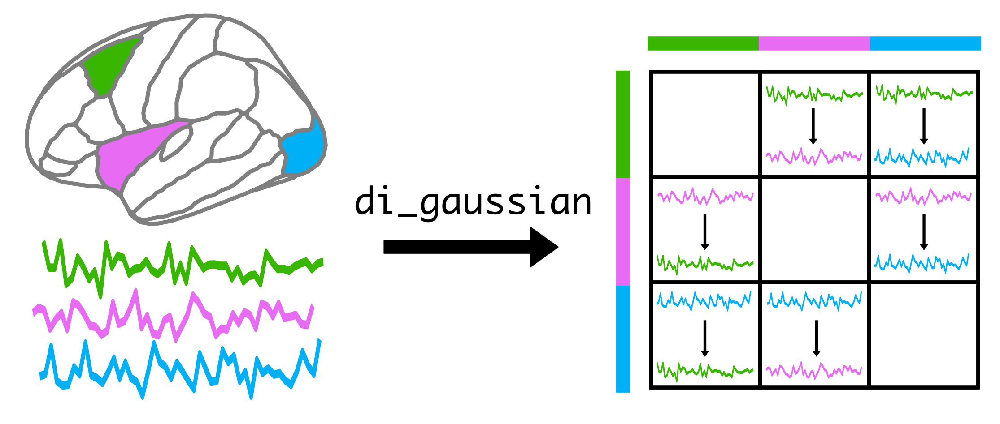

# Glossary of Terms

## Multivariate Time Series (MTS)

Multivariate time-series. As the name suggests, a MTS dataset comprises multiple variables (processes), each consisting of a fixed number of observations (samples). Each variable in the dataset is a time series itself, and these variables may or may not be related to one another.&#x20;

## Keywords

For each SPI, we associate a small number of keywords to help users understand the key assumptions of the interactions they measure. If you would like to filter SPIs based on their corresponding keywords, see [here](../../installing-and-using-pyspi/usage/advanced-usage/creating-a-reduced-spi-set.md). The following table summarises the keywords and provides a short description of each:

<table><thead><tr><th width="206">Keyword</th><th>Description</th></tr></thead><tbody><tr><td><mark style="color:purple;"><code>Undirected</code></mark></td><td>Measures that do not specify a direction of influence or flow between time series. They assess the strength or presence of a relationship without indicating which series is influencing the other. </td></tr><tr><td><mark style="color:purple;"><code>Directed</code></mark></td><td>Measures that identify the direction of influence or causal relationship between time series. They determine not only the presence, but also the direction of interaction from one time-series to the other.</td></tr><tr><td><mark style="color:purple;"><code>Linear</code></mark></td><td>Measures that assume a linear relationship between time series. These methods are most effective when changes in one series proportionally affect the other series in a consistent manner.</td></tr><tr><td><mark style="color:purple;"><code>Nonlinear</code></mark></td><td>Measures that <em>do not</em> assume a linear relationship between time series. These measures are used when the relationship between series is complex and cannot be adequately described by linear models. </td></tr><tr><td><mark style="color:purple;"><code>Signed</code></mark></td><td>Some SPIs can take a positive or negative value. For example, correlation coefficients are signed as they can take a value within [-1, 1]. Other SPIs, such as distance correlation (defined in the range [0,1]) are unsigned. This keyword refers to whether the sign of the SPI indicates how fluctuations in time series A correspond to that of time series B. </td></tr><tr><td><mark style="color:purple;"><code>Univariate</code></mark></td><td>Refers to a single time series measurement. </td></tr><tr><td><mark style="color:purple;"><code>Bivariate</code></mark></td><td>Refers to measures that involve two time series (i.e., pairs of time-series).</td></tr><tr><td><mark style="color:purple;"><code>Multivariate</code></mark></td><td>Refers to measures that involve more than two time series. </td></tr><tr><td><mark style="color:purple;"><code>Contemporaneous</code></mark></td><td>Measures that focus on relationships or interactions occurring at the same point across time series. </td></tr><tr><td><mark style="color:purple;"><code>Time-dependent</code></mark></td><td>Measures that analyse how relationships between time series evolve over time.</td></tr><tr><td><mark style="color:purple;"><code>Frequency-dependent</code></mark></td><td>Measures that analyse relationships in the frequency domains.</td></tr><tr><td><mark style="color:purple;"><code>Time-frequency dependent</code></mark></td><td>Measures that analyse relationships in both the time and frequency domain.</td></tr></tbody></table>

## Directed SPIs

Some of the SPIs are **directed**, meaning that the value _**from**_ process A _**to**_ process B will be computed separately to the value from process B to process A. This generally results in asymmetric matrices, which can be useful for analysing the directionality of interactions.

As an example, consider the SPI `di_gaussian` which measures the directed information from process A to process B using a Gaussian density estimator, and an MTS consisting of three processes (e.g., three brain regions). The table returned by computing this SPI will be a 3x3 matrix, where entry `calc.table['di_gaussian'][0,1]` will be the directed information from process 0 to process 1. The rows in this table reflect the sources while the columns reflect the targets, as schematically depicted below:

<figure><figcaption></figcaption></figure>

***

## Modifiers

Many of the algorithms we implement include a number of free parameters that we set either using optimisation procedures or fix to a small number of sensible predefined settings. The combination of both the **parameter configuration** and the **different summary statistics** gives each SPI in the library a **unique identifier** (as a string).

As an example, consider the SPI identifier `xcorr_mean_sig-True.` Here, `xcorr` refers to the method of cross-correlation between x and y, which itself does not provide a single statistic, but rather a correlogram. However, the two additional modifiers that are separated by underscores in the identifier, `mean` and `sig-True`, collectively return a scalar value. The first modifier, `mean` indicates that we are taking the average across lags of the cross-correlation function. The second modifier, `sig-True` indicates that we will only take the mean over statistically significant lags.&#x20;

By using different parameters and modifiers of distinct methodologies, we obtain hundreds of SPIs.&#x20;

## Matrix of Pairwise Interactions (MPI)

An M-by-M square matrix of pairwise interactions for M-variate time-series that is obtained by computing a single SPI. For undirected SPIs, this matrix will be symmetric about the diagonal, that is, entry \[i, j] will be equal to entry \[j, i]. On the other hand, for directed SPIs, the MPI will generally be asymmetric.&#x20;

