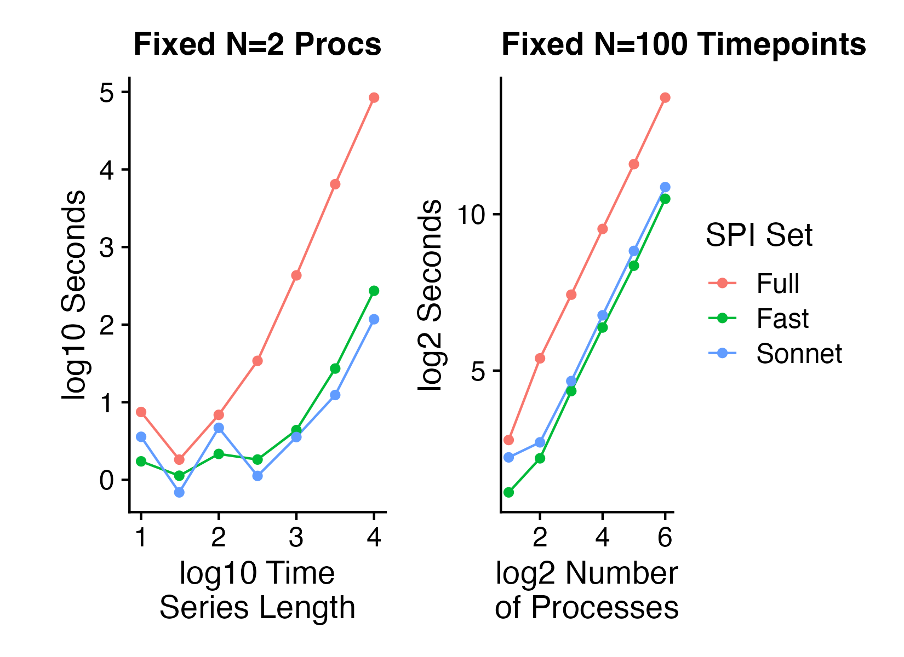
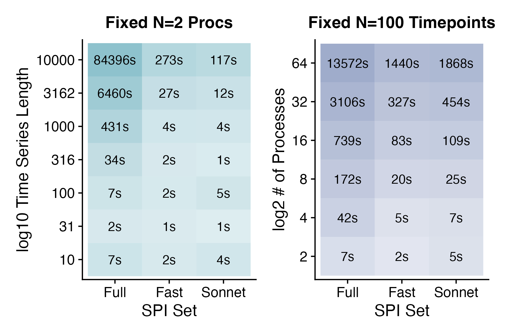

# FAQ

> ### _How many SPIs should I measure for my dataset?_

When starting out, we recommend that users work with a smaller subset of available SPIs first, so they get a sense of computation times and working with the output in a lower-dimensional space. Users have the option to pass in a customised configuration _.yaml_ file as described in the [creating a reduced SPI set documentation. ](advanced-usage/creating-a-reduced-spi-set.md)

Alternatively, we provide two pre-defined subsets of SPIs that can serve as good starting points: _sonnet_ and _fast_. The _sonnet_ subset includes 14 SPIs selected to represent the 14 modules identified through hierarchical clustering in the [original paper](https://www.nature.com/articles/s43588-023-00519-x). To retain as many SPIs as possible while minimising computation time, we also offer a _fast_ option that omits the most computationally expensive SPIs. Either SPI subset can be toggled by setting the corresponding flag in the [_Calculator_](../../information-about-pyspi/api-reference/pyspi.calculator.calculator.md)_()_ function call as follows:

```python
from pyspi import Calculator
data = ... # your dataset
calc = Calculator(dataset=data, subset="sonnet") # or calc = Calculator(subset="fast")
```

***

> ### _What pre-processing steps are applied to my data?_&#x20;

There are two pre-processing steps that can be applied to your raw multivariate time series (MTS) dataset before computing SPIs:&#x20;

(1) **Detrend:** Detrend each time series in the dataset individually along the time dimension using the [SciPy detrend function](https://docs.scipy.org/doc/scipy/reference/generated/scipy.signal.detrend.html) with default settings. If enabled, detrending is always applied to the dataset **before z-score normalisation.**&#x20;

(2) **Z-score normalise:** Normalise each time series in the dataset individually along the time dimension using the[ SciPy zscore function](https://docs.scipy.org/doc/scipy/reference/generated/scipy.stats.zscore.html).&#x20;

By **default**, when instantiating a [`Calculator()`](../../information-about-pyspi/api-reference/pyspi.calculator.calculator.md) object with your dataset, _pyspi_ will normalise each time series — representing a process in a MTS dataset — individually along the time axis.

If you would to specify which pre-processing steps to include/exclude, you can pass the corresponding flags for each operation when instantiating a [`Calculator()`](../../information-about-pyspi/api-reference/pyspi.calculator.calculator.md). Here are some examples of how you can skip either or both operations:

```python
# skip detrending, keep z-scoring
calc = Calculator(dataset=data, detrend=False)

# skip z-scoring, keep detrending
calc = Calculator(dataset=data, zscore=False, detrend=True)

# disable both detrending and zscoring
calc = Calculator(dataset=data, zscore=False, detrend=False)
```

After successfully instantiating a Calculator object, a summary of the pre-processing steps will be displayed for verification before computing SPIs. Here is an example of the output when explicitly setting the detrending step to `False`:

```
216 SPI(s) were successfully initialised.

[1/2] Skipping detrending of the dataset...
[2/2] Normalising (z-scoring) the dataset...
```

> ### _How long does pyspi take to run?_

This depends on the size of your multivariate time series (MTS) data – both the number of processes and the number of time points (observations). In general, we recommend that users try running _pyspi_ first with a small representative sample from their dataset to assess time and computing requirements, and scaling up accordingly. The amount of time also depends on the feature set you’re using – whether it’s the full set of all SPIs or a reduced set (like _sonnet_ or _fast_ described above).

To give users a sense of how long _pyspi_ takes to run, we ran a series of experiments on a high-performing computing cluster with 2 cores, 2 MPI, and 40GB memory. We ran _pyspi_ on simulated NumPy arrays with either a fixed number of processes (2) or fixed number of time points (100) to see how timing scales with the array size. Here are the results:

<figure><figcaption><p><strong>The time to run </strong><em><strong>pyspi</strong></em><strong> scales with the number of time points (left) or number of processes (right).</strong> </p></figcaption></figure>

We note that computation times for the _sonnet_ and _fast_ subset are roughly equivalent, and the full set of SPIs requires increasingly large amounts of time to compute with increasing time series lengths. The computation time for the full set of SPIs increases with a consistent slope to that of the _sonnet_ and _fast_ subsets with increasing number of processes (right).&#x20;

Here are the timing values for each condition, which can help users estimate the computation time requirements for their dataset:

<figure><figcaption></figcaption></figure>

***

> ### _How can I contribute to pyspi?_

Contributions play a vital role in the continual development and enhancement of pyspi, a project built and enriched through community collaboration. By participating in this project, you are contributing to the broader community and helping shape the future of this package.

Code is not the only way to contribute to _pyspi_. Reviewing pull requests, answering questions to help others and aid in troubleshooting, organising and teaching tutorials and improving documentation are all priceless contributions to the project. For further details on how you can contribute to the project, as well as general guidelines for our contributors, please refer to [Contributing to pyspi](../../development/development/contributing-to-pyspi.md).&#x20;

***

> ### _**Do I need to normalise my dataset before applying pyspi?**_

When passing your dataset into the Calculator object, _pyspi_ will automatically _**z-**_**score** (normalise) along the _time_ axis by default (see [API reference](../../information-about-pyspi/api-reference/pyspi.data.data.md) for Data object). This means that you can supply raw values to the Calculator object without having to normalise the dataset as a pre-processing step.

If you do not wish for _pyspi_ to _z-_&#x73;core your data, or you would like more control over how your data is pre-processed, you can pass the `normalise=False` flag to the `Calculator` when instantiating.&#x20;

```python
from pyspi.calculator import Calculator
import numpy as np

# your dataset
data = ... 

# instantiate a Calculator object as usual and set the normalise flag
calc = Calculator(dataset=data, normalise=False)

# disable both detrending and normalisation
calc = Calculator(datast=data, detrend=False, normalise=False)

```

***

> ### _**Can I distribute pyspi calculations across a cluster?**_

If you have access to a portable batch system (PBS) cluster and are processing MTS with many processes (or are analysing many MTS), then you may find the [_pyspi_ distribute](https://github.com/DynamicsAndNeuralSystems/pyspi-distribute) repository helpful. Each job contains one calculator object that is associated with one MTS. To get started with running pyspi jobs on a PBS-type cluster, follow our guide located [here](advanced-usage/distributing-calculations-on-a-cluster.md).&#x20;

***

> ### _**How can I cite pyspi in my work?**_&#x20;

If you used _pyspi_ in your work, it would be greatly appreciated if you [cite the original authors](../../welcome-to-pyspi/citing-pyspi.md). Feel free to star our [GitHub repository](https://github.com/DynamicsAndNeuralSystems/pyspi) if you find our package useful, as this also helps to increase awareness in the time-series analysis community.&#x20;

***

> ### _**Can I run pyspi on my operating system?**_

_pyspi_ is designed with cross-platform compatibility in mind and can be run on various operating systems, ensuring a wide range of users have access to pyspi and all of it features. Specifically, _pyspi_ currently supports:

* **MacOS (Python >= 3.9)**
* **Windows (Python >=3.8)**
* **Linux (Python >=3.8)**

In all cases, ensure that you have the required version of Python installed, as _pyspi_ is a python-based package. We actively monitor and work on compatibility issues that may arise with new updates to these operating systems. Users are encouraged to report any compatibility issues they encounter on our [GitHub issues page](https://github.com/DynamicsAndNeuralSystems/pyspi/issues), helping us improve _pyspi_ for all users.&#x20;

***

> ### _**Are there examples showcasing a complete pipeline using pyspi?**_

Yes, we currently provide two notebooks with examples of complete pipelines using _pyspi_. These notebooks are available in the[ Usage Examples](walkthrough-tutorials/) section. If you want to share a notebook with additional pipelines or specific use cases, please feel free to contact us.&#x20;

***

> ### _**How can I save my results from pyspi?**_&#x20;

Once you have computed the SPIs for your dataset, the results will be stored in the calculator object. We recommend saving the calculator as a .[`pkl`](https://docs.python.org/3/library/pickle.html) file using the [dill library in python](https://pypi.org/project/dill/). To get started, you will need to install the dill package: <mark style="color:red;">`pip install dill`</mark>.

1. _**Saving**_ a calculator

```python
from pyspi.calculator import Calculator
import dill

# compute the SPIs as usual
data = np.load('../pyspi/data/forex.npy').T
calc = Calculator(dataset=data, subset='fast')
calc.compute()

# save the calculator object as a .pkl
with open('saved_calculator_name.pkl', 'wb') as f:
    dill.dump(calc, f)
```

2. _**Loading**_ a calculator

```python
# specify the location of your saved calculator .pkl file
loc = '../pyspi/saved_calculator_name.pkl'

with open(loc, 'rb') as f:
    calc = dill.load(f)

# now access the calculator object as usual
calc.table
calc.table['cov_EmpricialCovariance']
```

***
