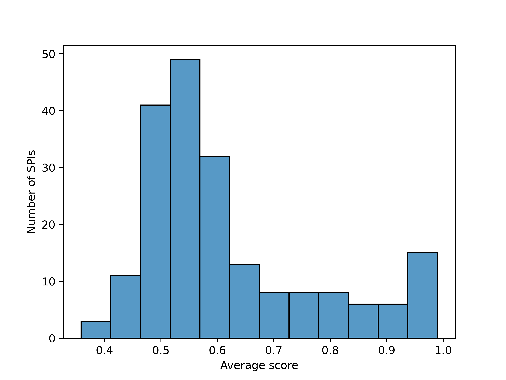

# Finance: Stock Price Time Series

## 1. Preparing the environment and data

First, we need to import some tools for downloading and minimally processing the data. You may need to _install a few non-standard libraries first:_

```bash
pip install yfinance
pip install scipy
pip install scikit-learn
```

Now, we will download financial data from one of two sources, Yahoo finance (yahoo) and the St. Lois Federal Reserve, by defining a function `download()` and passing in the tickers corresponding to the FAANG stocks: Facebook/Meta, Amazon, Apple, Netflix and Google:

```python
import datetime, warnings
import yfinance as yf
import pandas as pd
import numpy as np
from scipy.stats import zscore
from scipy.signal import detrend

def download(symbols, start, days):
    
    end = start + datetime.timedelta(days=days)
    
    startstr = start.strftime('%Y-%m-%d')
    endstr = end.strftime('%Y-%m-%d')
    
    print(f'Obtaining {symbols} data from {startstr} to {endstr}...')
    close = yf.download(symbols, start=startstr, end=endstr, progress=True)['Close']
    
    # Match data up with weekdays
    weekdays = pd.date_range(start=startstr, end=endstr, freq='B')
    close = close.reindex(weekdays)
    
    # For any NaN's, propogate last valid value forward (and remove first value)
    z = close.fillna(method='ffill').values.T[:,2:]
    
    # Make sure to always detrend and normalise your data, otherwise most statistics will give spurious results.  
    return detrend(zscore(z,ddof=1,nan_policy='omit',axis=1))

# The FAANG tickers (Facebook/Meta, Amazon, Apple, Netflix, Google)
stocks = ['META','AMZN','AAPL','NFLX','GOOGL']

# We'll download 140 days of data (corresponding to ~100 observations from business days)
ndays = 140

# Set a recent(ish) starting date for the period
start_datetime = datetime.datetime.strptime('2014-01-01', '%Y-%m-%d') # Earliest date we will sample

print('Begin data download.')
z = download(stocks,start_datetime,ndays)
print(f'Done. Obtained MTS of size {z.shape}')
```

***

## 2. Inspecting the MTS

Now that we've obtained our data, we can inspect it to make sure everything looks okay. Let's begin by visualising the MTS in a single heatmap:

```python
import matplotlib.pyplot as plt
from scipy.stats import zscore
import seaborn as sns

def plot_data(z,labels):
    plt.subplots()
    plt.pcolormesh(z,vmin=-1.5,vmax=1.5,cmap=sns.color_palette('icefire_r',as_cmap=True))
    plt.colorbar()

    ticks = [t+0.5 for t in range(len(labels))]
    plt.yticks(ticks=ticks, labels=labels)
    plt.xlabel('Time')
    plt.ylabel('Symbol')
    plt.show()

plot_data(z,stocks)
```

You should obtain a plot similar to the following:

<figure><figcaption><p>Each row corresponds to an individual ticker (e.g., "NFLX") and each column corresponds to a measurement at a single time point. </p></figcaption></figure>

***

## 3. Applying _pyspi_

Next, we instantiate a `Calculator` object using our data and compute all pairwise interactions. Then, we can inspect the results table:

```python
from pyspi.calculator import Calculator

# These two lines show the main usage of the calculator: simply instantiate and compute.
calc = Calculator(z)
calc.compute()

# We can now inspect the results table, which includes hundreds of pairwise interactions.
print(calc.table)
```


As an example, below we will examine how covariance, dynamic time warping, and Granger causality differs when computing the relationship between the FAANG stock-market data.

```python
import matplotlib.pyplot as plt
from matplotlib import colors

def plot_mpi(S,identifier,labels,ax=None):
    """ Plot a given matrix of pairwise interactions, annotating the process labels and identifier
    """
    if ax is None:
        _, ax = plt.subplots()
    plt.sca(ax)

    # Use a diverging cmap if our statistic goes negative (and a sequential cmap otherwise)
    if np.nanmin(S) < 0.:
        maxabsval = max(abs(np.nanmin(S)),abs(np.nanmax(S)))
        norm = colors.Normalize(vmin=-maxabsval, vmax=maxabsval)
        plt.imshow(S,cmap='coolwarm',norm=norm)
    else:
        plt.imshow(S,cmap='Reds',vmin=0)

    plt.xticks(ticks=range(len(stocks)),labels=labels,rotation=45)
    plt.yticks(ticks=range(len(stocks)),labels=labels)
    plt.xlabel('Symbol')
    plt.ylabel('Symbol')
    plt.title(identifier)
    plt.colorbar()

# Iterate through the four methods (covariance, dynamic time warping, Granger causality, and convergent cross-mapping), extract and plot their matrices
spis = ['cov_EmpiricalCovariance','dtw_constraint-itakura','gc_gaussian_k-max-10_tau-max-2','ccm_E-None_max']
for identifier in spis:
    # Simply index an SPI in the output table, which will give you an MxM dataframe of pairwise interactions (where M is the number of processes)
    S = calc.table[identifier]

    # Plot this dataframe
    plot_mpi(S,identifier,stocks)
```

You should obtain four separate plots, each corresponding to one of the four methods. Here we show an example of the 5x5 matrix of pairwise interactions (MPI) for the convergent cross-mapping method (identifier `ccm`):

<div align="center"><figure><figcaption></figcaption></figure></div>

***

## 4. Classifying MTS using SPIs

Now that you know how to compute the hundreds of pairwise interactions from data, let's put them to the test!

This part of the tutorial illustrates how to use _sklearn_ to classify between two types of time-series using a comprehensive representation of their pairwise interactions.

Here, we will try to delineate the **stock-market data** of earlier from **foreign exchange-rate data**. We will start by downloading several instances of the data type for training/testing our classifier.

```python
# Add in some more symbols for the market rates
forex = ['USDJPY=X','USDEUR=X','CNYUSD=X','GBP=X','CADUSD=X']

ninstances = 20

# Dict to store our results (given by the key (type,starting date))
database = {}
for i in range(ninstances):
    # Iterate the start datetime by ndays for each instance
    start_datetime = start_datetime + datetime.timedelta(days=ndays)
    print(f'[{i}/{ninstances-1}] Downloading data for the 140 period starting at {start_datetime}.')

    # Download the stock data (and plot)
    database[('stocks',start_datetime)] = download(stocks,start_datetime,ndays)
    plot_data(database[('stocks',start_datetime)],stocks)
    
    # Download the forex data (and plot)
    database[('forex',start_datetime)] = download(forex,start_datetime,ndays)
    plot_data(database[('forex',start_datetime)],forex)

print(f'Successfully downloaded {ninstances} datasets of both types of data.')
```

Now, compute all pairwise interactions for all datasets (storing the results). For the purposes of demonstration, we will use the 'fast' subset to speed up calculations.&#x20;

<pre class="language-python"><code class="lang-python">from copy import deepcopy

# First, let's create one calculator and copy it for each MTS so that we don't need to re-initialise each time
<strong>calc = Calculator(subset='fast')
</strong>
results = {}
for key in database:

    # Copy the top-level calculator
    mycalc = deepcopy(calc)

    # Name the calculator after the type of data (stock/forex) plus the starting date
    mycalc.name = key[0] + '_' + key[1].strftime('%Y-%m-%d')
    
    # Ensure we have no NaNs in our dataset (preferably using a more clever way of data imputation than this one)
    dataset = np.nan_to_num(database[key])

    # Load the dataset
    mycalc.load_dataset(dataset)

    # Compute all pairwise interactions
    mycalc.compute()

    # Store our results
    results[key] = mycalc.table
</code></pre>

**Note:** This computation will take a few minutes to run. If you would like to proceed using a pre-computed results file, simply download the following .pkl file and save it in the same location as your Jupyter notebook:



<details>

<summary>[<strong>OPTIONAL</strong>]: Load pre-computed results</summary>

To load the downloaded results into your notebook, ensure it has been saved in the same location as the notebook .ipynb file and use the following code:

```python
import dill # pip install dill if you do not already have it installed

with open('psypi_finance_results.pkl', 'rb') as f:
    results = dill.load(f)


```

</details>

Let's see if we can tell whether our data is Forex or stock-market data based on the covariance matrix. We will train a support vector machine (SVM) to perform the classification task.

<pre class="language-python"><code class="lang-python">from sklearn import svm
from sklearn.model_selection import train_test_split
from sklearn.metrics import balanced_accuracy_score
from sklearn.preprocessing import StandardScaler

scaler = StandardScaler()

def get_data_matrix(table,spi):
    """ For a given SPI, extract the off-diagonals as feature vectors
    """

    # For each dataset in the results table...
    for k in table:
        # ...Extract the matrix corresponding to this SPI...
        A = table[k][spi].values

        # ...Vectorise and join the upper and lower triangles to form a feature vector...
        x = np.concatenate([A[np.triu_indices(A.shape[0],1)],
                            A[np.tril_indices(A.shape[0],-1)]])
        x = np.atleast_2d(x)

        # ...and concatenate each feature vector together to form a data matrix
        try:
            X = np.concatenate([X,x], axis=0)
        except NameError:
            X = x
    return X

def get_accuracy(clf,X,y):
    nrepeats = 5
    score = np.full(nrepeats,np.nan)
    for r in range(nrepeats):
        # Convert the data into half-half train/test split
        X_train, X_test, y_train, y_test = train_test_split(X, y, test_size=0.5, random_state=r)

        # Normalise the features so that the SVM behaves well
        X_train = scaler.fit_transform(X_train)

        # Fit the classifier
        clf.fit(X_train,y_train)

        # Scale the test data (with the same scaler as above)
        X_test = scaler.transform(X_test)

        # Predict the output
        y_pred = clf.predict(X_test)

        # Get the accuracy for this train/test split (should be balanced)
        score[r] = balanced_accuracy_score(y_test, y_pred)
    
    # Return the average score
    return np.nanmean(score)

<strong># First check with the standard covariance matrix
</strong>spi = 'cov_EmpiricalCovariance'
X = get_data_matrix(results,spi)

# Set up the dataset labels for classification ("forex" == 0, "stocks" == 1)
y = np.array([int(key[0] == 'stocks') for key in results])

# Linear SVM classifier using the default settings
clf = svm.SVC(kernel='linear')

score = get_accuracy(clf,X,y)

print(f'Average accuracy for {spi} in delineating ForEx from FAANG data: {score}')
</code></pre>


_You should obtain an average accuracy of around **98%**._

***

Now that we have tried classifying data using a single SPI, let's try this out for every SPI and see how they all perform and plot the results:

```python
from sklearn.model_selection import train_test_split
import seaborn as sns

# Repeat last cell for each SPI
scores = {}
spis = mycalc.spis.keys()
for spi in spis:
    X = get_data_matrix(results,spi)
    try:
        scores[spi] = get_accuracy(clf, X, y)
        print(f'Average score for {spi}: {scores[spi]}')
    except ValueError as err:
        print(f'Issue with SPI {spi}: {err}')

# Get a histogram 
sns.histplot(scores)
plt.xlabel('Average score')
plt.ylabel('Number of SPIs')
plt.show()
```

You should obtain a histogram like the following:

<figure><figcaption></figcaption></figure>

We can also inspect the average accuracy for each SPI individually:

```python
# Load into a pandas series to pretty-print the results
ser = pd.Series(scores)
with pd.option_context('display.max_rows', None, 'display.max_columns', None):
    print(ser.dropna().sort_values())

plt.show()
```

This should produce the following output with _'cov\_GraphicalLassoCV_' being the top performing SPI for distinguishing forex from stock market data:

```
tlmi_kernel_W-0.25                                        0.358636
xme_kozachenko_k1                                         0.392020
icoh_multitaper_max_fs-1_fmin-0_fmax-0-5                  0.400328
igci                                                      0.430909
mi_kernel_W-0.25                                          0.431515
je_kernel_W-0.5                                           0.432854
dswpli_multitaper_mean_fs-1_fmin-0-25_fmax-0-5            0.433359
wpli_multitaper_mean_fs-1_fmin-0_fmax-0-5                 0.446717
xcorr-sq_mean_sig-False                                   0.453788
mi_kraskov_NN-4                                           0.454823
tlmi_kraskov_NN-4                                         0.458813
xcorr-sq_max_sig-True                                     0.460606
dspli_multitaper_max_fs-1_fmin-0-25_fmax-0-5              0.461439
te_kraskov_NN-4_DCE_k-1_kt-1_l-1_lt-1                     0.463081
ce_kernel_W-0.5                                           0.464646
xme_kernel_W-0.5_k1                                       0.466035
wpli_multitaper_max_fs-1_fmin-0_fmax-0-5                  0.466136
coint_aeg_tstat_trend-c_autolag-aic_maxlag-10             0.468081
coint_aeg_tstat_trend-ct_autolag-aic_maxlag-10            0.468081
dswpli_multitaper_max_fs-1_fmin-0_fmax-0-5                0.468409
icoh_multitaper_max_fs-1_fmin-0_fmax-0-25                 0.469394
dspli_multitaper_max_fs-1_fmin-0_fmax-0-5                 0.470429
xme_gaussian_k10                                          0.474369
pli_multitaper_mean_fs-1_fmin-0_fmax-0-5                  0.476919
tlmi_kraskov_NN-4_DCE                                     0.477652
...
pdist_braycurtis                                          0.990000
cov_LedoitWolf                                            0.990000
cov_GraphicalLassoCV                                      0.990000
dtype: float64
```

We can also inspect the [MPIs ](../../../information-about-pyspi/spis/glossary-of-terms.md)to see what the distinguishing feature for our top performing SPI was:

```python
# Get our top-performing SPI
topspi = ser.index[ser.argmax()]
print(f'Inspecting top SPI ({topspi}) in more detail...')

# Unique time periods and datatypes
periods = np.unique([k[1] for k in results])
dtypes = ['stocks','forex']

# Set up our axes
fig, axs = plt.subplots(len(periods),2,figsize=(15,80))
for (d, p) in results:
    
    # Get the MPI for this dataset
    S = results[(d,p)][topspi]

    # The axis position
    i = [_i for _i, _p in enumerate(periods) if _p == p][0]
    j = [_j for _j, _d in enumerate(dtypes) if _d == d][0]

    # stocks or forex labels
    labels = globals()[dtypes[j]]

    # Plot the MPI
    plot_mpi(S,topspi,labels,ax=axs[i,j])
    plt.subplots_adjust(hspace=1.)

plt.tight_layout()
plt.show()
```

This should produce the following output (here we show a small snippet of the full output):

<figure><figcaption></figcaption></figure>

