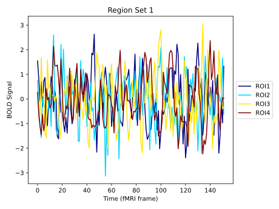
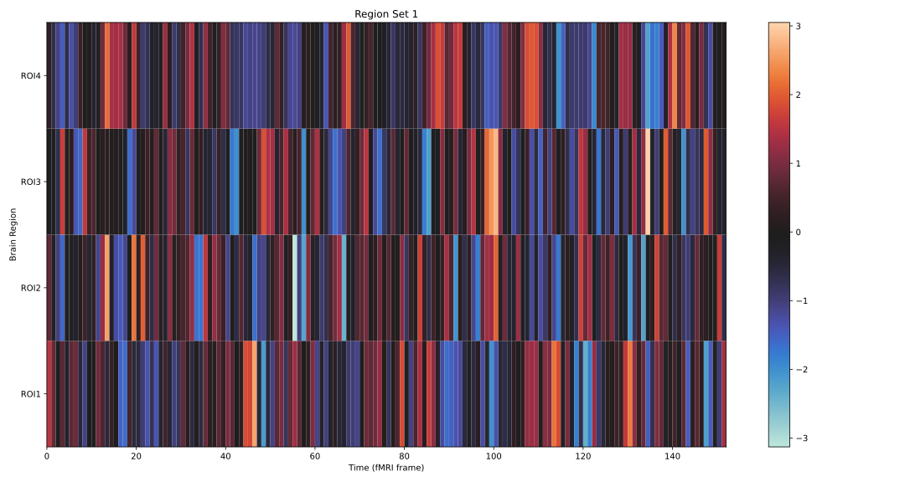
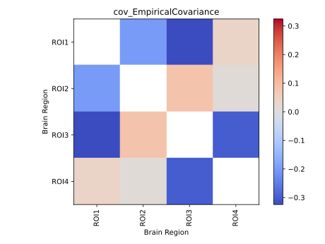

# Neuroimaging: fMRI Time Series

In this tutorial, we will be applying _pyspi_ to data derived from the [UCLA Consortium for Neuropsychiatric Phenomics LA5c Study](https://openneuro.org/datasets/ds000030/versions/00016), which is an open-access data source. We will focus on blood-oxygen level-dependent signalling (BOLD) time-series obtained from functional magnetic resonance imaging (fMRI).

The data used in this tutorial is **four sets of four brain** regions recorded from an anonymous participant. All fMRI time-series in this dataset are comprised of **152 time points** each (i.e., T = 152).&#x20;

The following cells are intended to be run sequentially, from top to bottom.&#x20;

## 1. Preparing the environment

We will first load all the modules needed for this demonstration. You may need to `pip install` one or more packages first.

```python
import pandas as pd
import numpy as np
import requests
import dill
from os import chdir, getcwd
from scipy.stats import zscore
import matplotlib.pyplot as plt
from scipy.stats import zscore
import seaborn as sns
from pyspi.calculator import Calculator
from matplotlib import colors, cm
from copy import deepcopy
```

***

## 2. Preparing the fMRI multivariate time-series (MTS) data

Now that we have imported the necessary libraries, let's read in the four sets of fMRI data, each corresponding to a separate region of interest (ROI), into _pandas_ DataFrames:

<pre class="language-python"><code class="lang-python"><strong># Store the set names
</strong><strong>sets = ["BOLD_fMRI_TS_set1", "BOLD_fMRI_TS_set2", "BOLD_fMRI_TS_set3", "BOLD_fMRI_TS_set4"]
</strong>base_url = "https://raw.githubusercontent.com/anniegbryant/CNS_2022/main/pyspi_tutorial/tutorial_example_data/"

# Download each of the sets and save locally
for se in sets:
    url = base_url + se + ".csv"
    r = requests.get(url)
    fname = se + ".csv"
    with open(fname, 'wb') as f:
        f.write(r.content)
    f.close()

# Load in the four sets (each 4 ROIs with 152 time points) of raw BOLD fMRI time-series
BOLD_fMRI_TS_set1 = pd.read_csv("BOLD_fMRI_TS_set1.csv",
                   header = None)

BOLD_fMRI_TS_set2 = pd.read_csv("BOLD_fMRI_TS_set2.csv",
                   header = None)

BOLD_fMRI_TS_set3 = pd.read_csv("BOLD_fMRI_TS_set3.csv",
                   header = None)

BOLD_fMRI_TS_set4 = pd.read_csv("BOLD_fMRI_TS_set4.csv",
                   header = None)
# We can arbitrarily label our brain regions ROI1, ROI2, ROI3, ROI4
region_labels = ["ROI1", "ROI2", "ROI3", "ROI4"]
</code></pre>

Now, let's inspect the first set (set1) to see how the data is set up:

```
BOLD_fMRI_TS_set1
```

You should obtain the following dataframe. As per the output, the dataframe is 4 rows by 152 columns. Each row corresponds to one of the four brain regions, and each column corresponds to a measurement at a single time point:

<figure><figcaption></figcaption></figure>

This is the format that _pyspi_ expects: **processes** (e.g., brain regions) **as the rows** and **time-points as the columns**. If you have different input data that is transposed, you can easily transpose the pandas DataFrame using the `transpose()` function.&#x20;

To continue our exploratory data analysis, we can view the raw time series values for the first set of regions:

```python
def plot_data_lines(data, labels, title):
    plt.figure()
    data.transpose().plot(colormap=cm.jet)

    ax = plt.gca()
    ax.legend(labels=labels, loc='center left', bbox_to_anchor=(1, 0.5))
    plt.title(title)
    plt.xlabel('Time (fMRI frame)')
    plt.ylabel('BOLD Signal')
    plt.show()
    
plot_data_lines(BOLD_fMRI_TS_set1, title="Region Set 1", labels = region_labels)
```

<figure><figcaption></figcaption></figure>

Alternatively, we can visualise the time-series for this first set of brain regions as a heatmap:

```python
# Plotting the data as a heatmap
def plot_data_heatmap(data, labels, title):
    plt.subplots()
    plt.pcolormesh(data,cmap=sns.color_palette('icefire',as_cmap=True))
    plt.colorbar()
    plt.title(title)
    ticks = [t+0.5 for t in range(len(labels))]
    plt.yticks(ticks=ticks, labels=labels)
    plt.xlabel('Time (fMRI frame)')
    plt.ylabel('Brain Region')
    plt.show()

plot_data_heatmap(BOLD_fMRI_TS_set1, labels = region_labels, title="Region Set 1")
```

You should obtain a heatmap like the following:

<figure><figcaption></figcaption></figure>

You can also use the same two plotting functions -- `plot_data_lines()` and `plot_data_heatmap()` to visualise the raw time-series data for the other three sets of regions.&#x20;

***

## 3. Run _pyspi_ on a single dataset

Our data is now downloaded and ready to process with _pyspi._ There are two main steps to run _pyspi_ and extract all of our pairwise statistics:

1. Initialise the `Calculator` object; and
2. Compute the `Calculator` object.

In the first step, you have some flexibility to play around with which SPIs you want to compute from the input time-series data. By default, _pyspi_ will compute all available SPIs. However, this can take a long time depending on how many observations you have. If you want to give pyspi a try with a reduced feature set that runs quickly, you can pass `subset='fast'` as an additional parameter when instantiating the `Calculator:`

```python
# First, ensure there is no NAN's inthe dataset
BOLD_fMRI_TS_set1 = np.nan_to_num(BOLD_fMRI_TS_set1)

# Instantiate calculator object
calc_set1 = Calculator(BOLD_fMRI_TS_set1, subset="fast")

# Compute the instantiated calculator object
calc_set1.compute()
```

_**OPTIONAL:**  If you want to use the pre-computed calc\_set1 object, you can simply download the file: pyspi\_calc\_set1.pkl and **save** it in the same location as your jupyter notebook._


Download the pre-computed calculator object for set 1.


To load the ._pkl_ file, do the following:

```python
with open('pyspi_calc_set1.pkl', 'rb') as f:
    calc_set1 = dill.load(f)
```

We can then inspect the resulting statistical pairwise interactions (SPIs) using the `calc_set1.table` object:

```python
print(calc_set1.table)
```

This output contains the resulting values from all of the SPIs concatenated together. We can view the list of SPIs that we calculated using the `.keys()` method:

```python
calc_set1.spis.keys()
```

Using their corresponding key/identifier, we can isolate one of the SPIs and visualise the results across the brain regions. For example, let's look at the matrix of pairwise interactions (MPI) for the covariance (identifier `cov_EmpiricalCovariance`) :

```python
def plot_mpi(S,identifier,labels,ax=None):
    """ Plot a given matrix of pairwise interactions, annotating the process labels and identifier
    """
    if ax is None:
        _, ax = plt.subplots()
    plt.sca(ax)

    # Use a diverging cmap if our statistic goes negative (and a sequential cmap otherwise)
    if np.nanmin(S) < 0.:
        maxabsval = max(abs(np.nanmin(S)),abs(np.nanmax(S)))
        norm = colors.Normalize(vmin=-maxabsval, vmax=maxabsval)
        plt.imshow(S,cmap='coolwarm',norm=norm)
    else:
        plt.imshow(S,cmap='Reds',vmin=0)

    plt.xticks(ticks=range(len(labels)),labels=labels,rotation=90)
    plt.yticks(ticks=range(len(labels)),labels=labels)
    plt.xlabel('Brain Region')
    plt.ylabel('Brain Region')
    plt.title(identifier)
    plt.colorbar()


# Plot this dataframe
plot_mpi(S = calc_set1.table["cov_EmpiricalCovariance"], identifier = "cov_EmpiricalCovariance", labels = region_labels)
```

You should obtain the following plot of the MPI:

<figure><figcaption></figcaption></figure>

***

## 4. Running _pyspi_ for multiple datasets

In the previous section, we ran through the _pyspi_ pipeline for one dataset. In practice, you may have several datasets that you wish to process with _pyspi_, so here we cover tips for iterative processing.

We begin by creating a dictionary containing our other three datasets to process:

```python
datasets_to_process = {"Set2": BOLD_fMRI_TS_set2,
            "Set3": BOLD_fMRI_TS_set3,
            "Set4": BOLD_fMRI_TS_set4}

# We can initialise one calculator and copy it for each dataset to save time
calc = Calculator(subset="fast")

results = {}

# Iterate over each dataset
for key in datasets_to_process:

    # copy over the top-level calculator
    mycalc = deepcopy(calc)
    
    # Name the calculator after the ROI set
    mycalc.name = key[0]
    
    # Ensure we have no NaNs in our dataset
    dataset = np.nan_to_num(datasets_to_process[key])
    
    # Load the dataset
    mycalc.load_dataset(dataset)
    
    # Compute all pairwise interactions
    mycalc.compute()
    
    # Store our results
    results[key] = mycalc.table
    
```

This combines the SPI tables from each set into a single dictionary. This step takes about 2 minutes to run, so if you want to skip this part, you can load the pre-computed results dictionary as follows:

```python
with open('three_sets_results.pkl','rb') as f:
    results = dill.load(f)
```

We can then concatenate the dictionary of dataframes into one large dataframe as follows:

```
df_all_results = pd.concat(results, axis=0)
df_all_results
```

***

## 5. Downstream Analysis

### Exporting data to R

For users who use _R_ for data wrangling and visualisation, we can save the _pyspi_ output to a pickle file (`.pkl`) and write a custom function to load this data into _R_ with the `reticulate()` package. We can practice with the `calc_set1` results, by first saving `calc_set1.table` to its own `.pkl` file:

```python
with open('pyspi_calc_set1_table.pkl', 'wb') as f:
    dill.dump(calc_set1.table, f)
```

We can then define a separate python script containing a function to extract the SPI data from our `pyspi_calc_table.pkl` file -- found in this repo as `pickle_reader_for_R.py`. Here are the contents:

```python
from pygments import highlight
from pygments.lexers import PythonLexer
from pygments.formatters import HtmlFormatter
import IPython

with open('R_interface/pickle_reader_for_R.py') as f:
    code = f.read()

formatter = HtmlFormatter()
IPython.display.HTML('<style type="text/css">{}</style>{}'.format(
    formatter.get_style_defs('.highlight'),
    highlight(code, PythonLexer(), formatter)))
```
